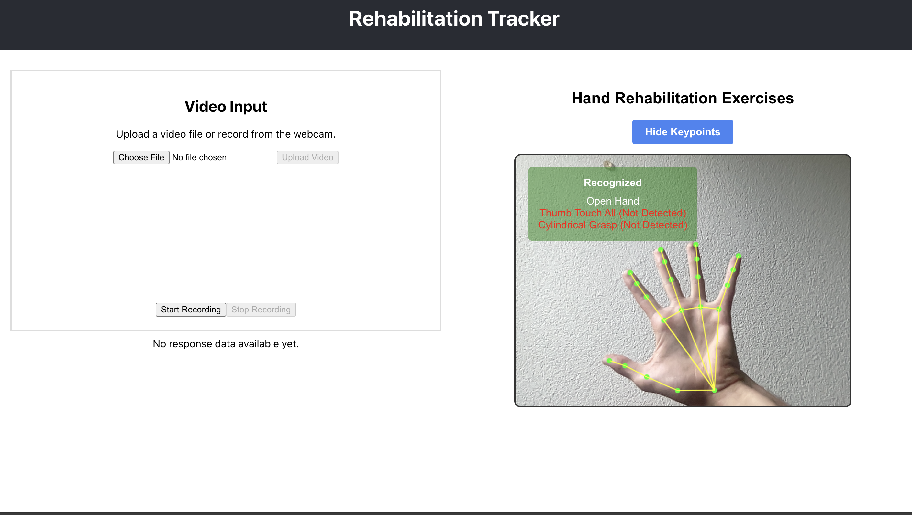

# 🧠 bt_poseguardian



**bt_poseguardian** is a full-stack real-time gesture recognition system for tracking hand gestures and exercises using webcam input. It's ideal for physical rehabilitation, gesture interfaces, and movement tracking with advanced AI-powered analysis capabilities.

## 💡 Features

### Core Functionality
- FastAPI backend with MediaPipe for hand gesture recognition
- React frontend with live video view and gesture status
- Real-time webcam gesture recognition
- MongoDB integration for data logging
- Dockerized for easy deployment

### Exercise Recognition
The system can recognize and track three specific exercises using heuristic models:
- **OpenHand Pose**: Detects open hand positioning and posture
- **Sequential Thumb-to-Finger Opposition Task**: Tracks thumb touching each finger in sequence
- **Cylindrical Grasp**: Recognizes cylindrical grasping motions and hand positioning

### AI-Powered Analysis
- **Google API Integration**: Compare raw video input vs. keypoint data using Multimodal Large Language Models (MLLM)
- **Enhanced Analytics**: Leverage AI to provide detailed movement analysis and feedback
- **Comparative Assessment**: Side-by-side analysis of video footage and extracted pose data

## 🛠 Tech Stack
- **Backend**: Python, FastAPI, OpenCV, MediaPipe
- **Frontend**: React
- **Database**: MongoDB
- **AI Integration**: Google API, Multimodal LLMs
- **Computer Vision**: MediaPipe, OpenCV
- **Deployment**: Docker, Docker Compose

## 🚀 Getting Started with Docker

### 📦 Prerequisites

- [Docker](https://www.docker.com/) installed
- [Docker Compose](https://docs.docker.com/compose/) installed
- Google API key for MLLM functionality

### 📁 Example `.env` file

Create a `.env` file in the root of your project and add (not committed to Git):

```env
GOOGLE_API_KEY=your_google_api_key_here
MONGO_URI=your_mongo_uri_here
```

And please edit the env variables in the docker-compose.yaml file.

### 🛠 Build Docker Images Locally

To build the Docker images for both the backend and frontend locally, run:

```bash
docker-compose build
```

### ▶️ Run the Application  

Run this command to start the application:

```bash  
docker-compose up  
```

This will start:
- **Backend**: http://localhost:8000
- **Frontend**: http://localhost:80

### 🛑 Stop the App
Press Ctrl+C in your terminal, then:

```bash
docker-compose down
```

## 🎯 Exercise Recognition Details

### OpenHand Pose
Detects when the hand is in an open, relaxed position with fingers extended. Useful for rehabilitation exercises focusing on hand opening and extension.

### Sequential Thumb-to-Finger Opposition Task
Tracks the sequential touching of thumb to each finger (index, middle, ring, pinky). This is commonly used in neurological assessments and fine motor skill rehabilitation.

### Cylindrical Grasp
Recognizes when the hand forms a cylindrical grasp pattern, simulating holding objects like bottles or cans. Important for assessing grip strength and coordination.

## 🤖 AI Analysis Features

The system leverages Google's Multimodal Large Language Models to provide:
- Comparative analysis between raw video and extracted keypoint data
- Detailed movement quality assessment
- Real-time feedback on exercise performance
- Advanced pattern recognition beyond traditional computer vision

## 🔧 Development

For local development without Docker, ensure you have:
- Python 3.10+
- Node.js 18+
- MongoDB (Cloud) Access
- Valid Google API credentials

## 📊 Data Collection

All gesture data and exercise performance metrics are stored in MongoDB for:
- Progress tracking over time
- Performance analytics
- Research and rehabilitation insights
- Historical comparison and improvement tracking