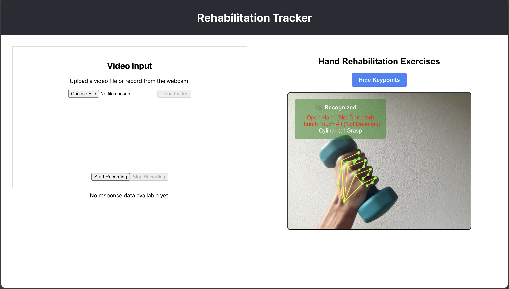
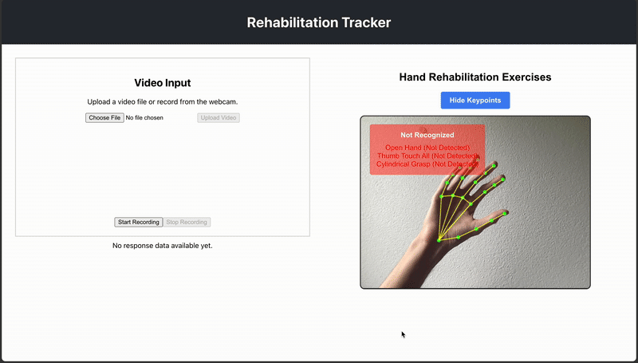
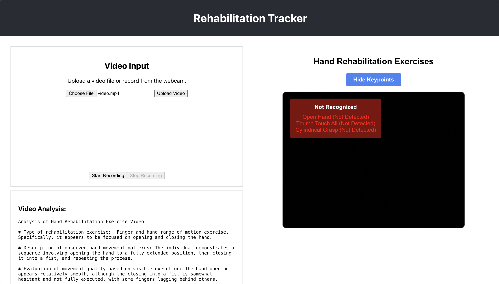
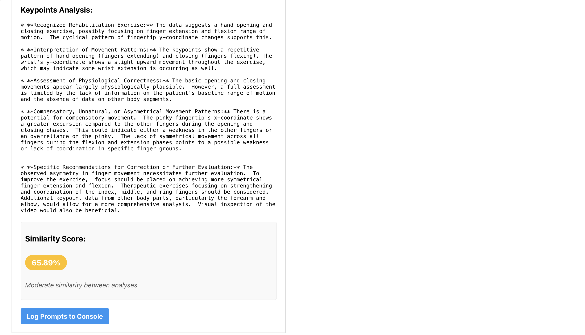

# 🧠 bt_poseguardian


**bt_poseguardian** is a full-stack real-time gesture recognition system for tracking hand gestures and exercises using webcam input. It's ideal for physical rehabilitation, gesture interfaces, and movement tracking with advanced AI-powered analysis capabilities.

## 📋 Table of Contents

- [Features](#-features)
- [Tech Stack](#-tech-stack)
- [Project Structure](#-project-structure)
- [Getting Started](#-getting-started-with-docker)
- [Exercise Recognition](#-exercise-recognition-details)
- [AI Analysis Features](#-ai-analysis-features)
- [Development](#-development)
- [Data Collection](#-data-collection)
- [Screenshots](#screenshots)

## 💡 Features

### Core Functionality
- FastAPI backend with MediaPipe for hand gesture recognition
- React frontend with live video view and gesture status
- Real-time webcam gesture recognition
- MongoDB integration for data logging
- Dockerized for easy deployment

### Exercise Recognition
The system can recognize and track three specific exercises using heuristic models:
- **OpenHand Pose**: Detects open hand positioning and posture
- **Sequential Thumb-to-Finger Opposition Task**: Tracks thumb touching each finger in sequence
- **Cylindrical Grasp**: Recognizes cylindrical grasping motions and hand positioning

### AI-Powered Analysis
- **Google API Integration**: Compare raw video input vs. keypoint data using Multimodal Large Language Models (MLLM)
- **Enhanced Analytics**: Leverage AI to provide detailed movement analysis and feedback
- **Comparative Assessment**: Side-by-side analysis of video footage and extracted pose data

## 🛠 Tech Stack

| Component | Technology |
|-----------|------------|
| **Backend** | Python, FastAPI, OpenCV, MediaPipe |
| **Frontend** | React |
| **Database** | MongoDB |
| **AI Integration** | Google API, Multimodal LLMs |
| **Computer Vision** | MediaPipe, OpenCV |
| **Deployment** | Docker, Docker Compose |

## 📁 Project Structure

```
bt_poseguardian/
├── backend_with_cam_DEBUG.py    # Main backend application with camera debugging
├── main.py                      # Primary application entry point
├── gestures.py                  # Gesture recognition logic and models
├── config.py                    # Configuration management
├── requirements.txt             # Python dependencies
├── Dockerfile                   # Docker container configuration
├── docker-compose.yaml         # Multi-container orchestration
├── .dockerignore               # Docker ignore patterns
├── .gitignore                  # Git ignore patterns
├── pictures/                   # Screenshots and documentation images
└── rehab-frontend/             # React frontend application
```

## 🚀 Getting Started with Docker

### 📦 Prerequisites

- [Docker](https://www.docker.com/) installed
- [Docker Compose](https://docs.docker.com/compose/) installed
- Google API key for MLLM functionality

### 📁 Environment Configuration

Create a `.env` file in the root of your project:

```env
GOOGLE_API_KEY=your_google_api_key_here
MONGO_URI=your_mongo_uri_here
```

> **Note**: The `.env` file is not committed to Git for security reasons. Also update environment variables in the `docker-compose.yaml` file.

### 🛠 Build and Run

1. **Build Docker Images Locally**
   ```bash
   docker-compose build
   ```

2. **Start the Application**
   ```bash
   docker-compose up
   ```

3. **Access the Application**
   - **Backend**: http://localhost:8000
   - **Frontend**: http://localhost:80

4. **Stop the Application**
   ```bash
   # Press Ctrl+C in terminal, then:
   docker-compose down
   ```

## 🎯 Exercise Recognition Details

### OpenHand Pose
- **Purpose**: Detects when the hand is in an open, relaxed position with fingers extended
- **Use Case**: Rehabilitation exercises focusing on hand opening and extension
- **Metrics**: Hand openness percentage, finger extension angles

### Sequential Thumb-to-Finger Opposition Task
- **Purpose**: Tracks the sequential touching of thumb to each finger (index, middle, ring, pinky)
- **Use Case**: Neurological assessments and fine motor skill rehabilitation
- **Metrics**: Sequence accuracy, timing between touches, completion rate

### Cylindrical Grasp
- **Purpose**: Recognizes when the hand forms a cylindrical grasp pattern
- **Use Case**: Simulating holding objects like bottles or cans, assessing grip strength
- **Metrics**: Grip formation quality, hand positioning accuracy

## 🤖 AI Analysis Features

The system leverages Google's Multimodal Large Language Models to provide:

| Feature | Description |
|---------|-------------|
| **Comparative Analysis** | Side-by-side comparison of raw video and extracted keypoint data |
| **Movement Quality Assessment** | Detailed analysis of exercise performance quality |
| **Real-time Feedback** | Instant feedback on exercise execution |

## 🔧 Development

### Local Development Setup (without Docker)

**Prerequisites:**
- Python 3.10+
- Node.js 18+
- MongoDB (Cloud) Access
- Valid Google API credentials

**Backend Setup:**
```bash
pip install -r requirements.txt
python main.py
```

**Frontend Setup:**
```bash
cd rehab-frontend
npm install
npm start
```

### Camera Configuration

The system automatically detects available cameras. 

## 📊 Data Collection

All gesture data and exercise performance metrics can be stored in MongoDB for:

- **Progress Tracking**: Monitor improvement over time
- **Performance Analytics**: Detailed statistical analysis
- **Research Insights**: Data for rehabilitation research
- **Historical Comparison**: Track long-term progress trends

## Screenshots

### Gesture Recognition Examples


*Cylindrical Grasp Recognition*


*Sequential Thumb-to-Finger Opposition Task*

### AI Analysis Interface


*MLLM Analysis Upload Interface*


*Comparative Analysis Results*